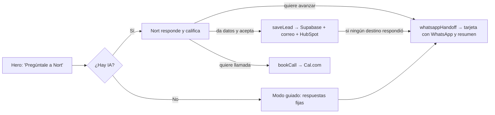
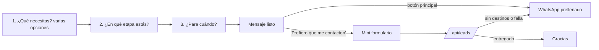
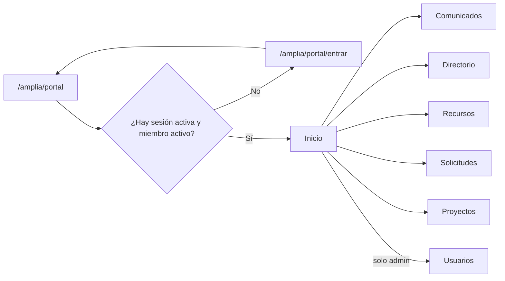

# 02 · Arquitectura de información

## 1. Mapa del sitio

El español vive en la raíz y el inglés bajo `/en`. Las rutas usan slugs en español en ambos idiomas; la excepción son los artículos del blog, que tienen slug traducido.

```text
northadigital.com
│
├── /                              Inicio (30-sep-2026)   (/en)
│   ├── #inicio                    Cerro en vivo: hora y clima de Hermosillo + fases del día
│   ├── #servicios                 10 servicios en 3 columnas (web y apps · IA · operación)
│   ├── #arma-tu-proyecto          "Cuéntanos qué necesitas": 4 pasos → WhatsApp o lead
│   ├── #trabajo                   Portafolio corto: los 14 portales en una cinta
│   ├── #preguntas                 4 preguntas (FAQPage)
│   └── #contacto                  WhatsApp, correo y ubicación (el formulario vive en /contacto)
│   (Al bajar, de fondo quedan solo las luces de la ciudad.)
│
├── /servicios                     Índice de servicios    (/en/servicios)
│   ├── /paginas-web
│   ├── /desarrollo-web            (antes /sistemas-a-la-medida: redirección 308)
│   ├── /aplicaciones
│   ├── /portales-administradores
│   ├── /chatbots-ia
│   ├── /inteligencia-artificial
│   ├── /digitalizacion
│   ├── /seguridad-vpn
│   ├── /mantenimiento-web
│   └── /capacitaciones            (antes /consultoria-tecnologica: redirección 308)
│
├── /portfolio                     Proyectos en producción, con filtros   (/en/portfolio)
├── /gobierno                      Portales municipales: flota, módulos, calidad, alianza
├── /blog                          Artículos, con filtro por tema
│   └── /[slug]                    Artículo (MDX); el selector de idioma lleva a la traducción
├── /contacto                      Contacto + FAQ
├── /privacidad                    Aviso de privacidad (LFPDPPP)
│
├── /amplia                        Amplía Consultoría — sitio hermano (acento teal)   (/en/amplia)
│   └── /portal                    INTRANET (solo español · noindex · requiere sesión)
│       ├── /entrar                Inicio de sesión
│       ├── /                      Inicio: comunicados fijados, mis solicitudes, proyectos activos
│       ├── /comunicados           Lista y detalle (/comunicados/[id])
│       ├── /directorio            Contactos: puesto, área, teléfono, extensión, correo
│       ├── /recursos              Enlaces y archivos internos por categoría
│       ├── /solicitudes           Solicitudes con tipos configurables y estados
│       ├── /proyectos             Tablero por estado
│       ├── /usuarios              Solo admin: altas, roles, activar/desactivar
│       └── /cuenta                Mi cuenta: nombre y contraseña
│
└── Sistema
    ├── /sitemap.xml  /robots.txt  /manifest.webmanifest  /icon.svg  /apple-icon.png
    └── /api/chat  (Nort)   /api/leads  (formularios)   /api/og  (imágenes para redes)   /api/clima  (clima de Hermosillo)
```

**Fuera del sitemap:** `/privacidad` (sí se indexa, pero con prioridad baja) y todo `/amplia/portal` (`noindex` y bloqueado en `robots.txt`).

## 2. Navegación

| Zona | Contenido |
|---|---|
| **Header** (fijo, transparente sobre el hero) | Logo animado · **Servicios** (mega menú con los 10 servicios, "Ver todos" y la tarjeta de Gobierno) · Portafolio · Gobierno · Blog · selector **Northa ⇄ Amplía** · idioma · tema · botón WhatsApp |
| **Celular** | Botón de menú que abre un diálogo de pantalla completa con foco atrapado, los mismos enlaces, las preferencias y WhatsApp |
| **Nort** | Botón flotante en todas las páginas públicas (no en la intranet); en celular se esconde mientras se ve el Cerro del inicio. Además, botones "Pregúntale a Nort" dentro del contenido |
| **Footer** (bloque azul marino) | Servicios · Northa (Portafolio, Arma tu proyecto, Gobierno, Blog, Amplía, Contacto) · Contacto · preferencias (pausar animaciones, idioma, tema) · aviso de privacidad |
| **Intranet** | Barra lateral: Inicio, Comunicados, Directorio, Recursos, Solicitudes, Proyectos, Usuarios (admin). Barra superior: usuario, tema y salir. Enlace de vuelta a la página pública de Amplía |

## 3. Flujos de usuario

### A. Búsqueda en Google → servicio → WhatsApp (flujo principal)

```mermaid
flowchart LR
  G[Google: "páginas web Hermosillo"] --> S["/servicios/desarrollo-web"]
  S -->|CTA principal| W[WhatsApp con 'Me interesa: Páginas web…']
  S -->|Duda| N[Nort]
  S -->|Quiere cotizar| A[Arma tu proyecto]
  N --> W
  A --> W
```

### B. Hero → Nort → WhatsApp o lead



### C. Configurador "Arma tu proyecto"



### D. Ayuntamiento

`/` (franja de gobierno) → `/gobierno` → portales en vivo (enlaces a los 14 dominios) → WhatsApp con el mensaje de gobierno → alianza con Amplía (`/amplia`).

### E. Amplía, lado público

Selector de marca (header) → `/amplia`: el acento cambia a teal con una transición → metodología (Venn) y servicios → llamar o escribir.

### F. Intranet de Amplía



## 4. Jerarquía de contenido por página

| Página | 1.º (lo que se ve primero) | 2.º | 3.º |
|---|---|---|---|
| Inicio | Cerro en vivo + propuesta en una línea + WhatsApp | Servicios + "Cuéntanos qué necesitas" | Portafolio corto, 4 preguntas y contacto |
| Servicio | Qué es (una línea) + WhatsApp y Nort | Qué incluye (4 puntos) | "También hacemos" y liga a "Cuéntanos qué necesitas" |
| Portafolio | Trabajo en producción, no maquetas | Caso destacado: la plataforma de 14 portales | Grid filtrable de proyectos → CTA |
| Gobierno | 14 portales en vivo | Qué construimos, módulos y calidad | Alianza con Amplía → WhatsApp de gobierno |
| Amplía | Qué es Amplía (ensō animado y promesa) | Quiénes somos, enfoque y metodología | Contacto (WhatsApp y teléfono de Northa) y acceso del equipo |
| Blog | Últimos artículos | Filtro por tema | — |
| Artículo | Título, fecha y lectura | Cuerpo | Traducción y CTA |
| Contacto | WhatsApp | Formulario | FAQ |
| Intranet · Inicio | Comunicados fijados | Mis solicitudes | Proyectos activos y accesos rápidos |

## 5. Arquitectura técnica

```text
northa-digital/
├── app/
│   ├── [locale]/            Sitio público (ES/EN). Todo se prerenderiza (SSG)
│   │   ├── layout.tsx       <html>, tema sin parpadeo, header, footer, Nort
│   │   ├── page.tsx         Inicio
│   │   ├── servicios/  portfolio/  gobierno/  amplia/  blog/  contacto/  privacidad/
│   │   └── not-found.tsx · error.tsx · [...rest]/
│   ├── amplia/portal/       INTRANET: otro layout raíz, solo español, dinámico (sesión)
│   ├── api/                 chat · leads · og · clima
│   └── sitemap.ts · robots.ts · manifest.ts · icon.svg · apple-icon.png
├── components/              brand · ui · layout · hero · cerro · sections · chat · forms · amplia · portal · blog
├── content/                 Textos y datos del sitio (TS) + blog en MDX (es/ y en/)
├── lib/                     i18n · seo · jsonld · ai · leads · supabase · three · cerro · hooks · utils
├── public/                  cerro/ · portfolio/ · escudos/ · brand/ · amplia/
├── scripts/                 pósters del Cerro · activos de marca · alta del primer admin · auditoría
├── supabase/migrations/     SQL para el proyecto NUEVO de Supabase de la landing
├── docs/                    Estos documentos
├── proxy.ts                 Idiomas + sesión de la intranet
└── .github/workflows/       ci.yml (PR y main) · deploy.yml (opcional: deploy por Actions)
```

### Decisiones clave

| Decisión | Por qué |
|---|---|
| **Next.js 16** (no 15) | Es la versión estable actual. Trae `proxy.ts`, tipos de rutas y React 19.2 |
| **i18n propio** (sin librería) | Dos idiomas, diccionarios tipados y rutas estáticas: menos peso y control total del SEO |
| **Contenido en archivos** (sin CMS) | Solo Roberto edita. Queda versionado en Git, es gratis y no hay otro servicio que se caiga |
| **Supabase NUEVO** para leads e intranet | Aislado de la base de los municipios. El código **se niega** a escribir en el proyecto `qpilnqzgsndymktgodoq` |
| **Intranet con otro layout raíz** | No carga el header de marketing ni Nort. Es dinámica por la sesión, mientras el sitio público sigue 100 % estático |
| **Deploy con `git push`** | La repo es personal (`r0b3rt0g1l/northa-landing`), así que Vercel despliega solo con Git conectado. `deploy.yml` (GitHub Actions + Vercel CLI) queda listo y apagado por si la repo pasa a una organización privada, donde Hobby no despliega solo |
| **Analítica sin cookies** (Vercel) | Congruente con la promesa de privacidad. GA4 es opcional y queda documentado |
| **JS pesado bajo demanda** | GSAP, Motion (Framer Motion) y Three.js no viajan en la carga inicial. GSAP y Motion se descargan cuando su sección se acerca a la pantalla (`lib/gsap.ts`, `ScopeStepMotion`); Three.js, después del `load` y de un momento ocioso, detrás del póster del Cerro (`CerroBackdrop`) |
| **`content-visibility` en secciones de abajo** | El primer cuadro solo calcula lo que se ve (`deferRender` en `lib/utils.ts`). `HashAlign` corrige los saltos a anclas cuando las alturas reales llegan |
| **Apariciones con CSS** (`animation-timeline: view()`) | No esperan a la hidratación ni cuestan JavaScript; sin soporte, el contenido simplemente aparece |

## 6. Modelo de datos (Supabase)

| Tabla | Para qué | Quién lee | Quién escribe |
|---|---|---|---|
| `leads` | Leads de formulario, chat y configurador | Nadie desde el navegador (RLS sin políticas; solo la llave secreta del servidor) | Servidor |
| `amplia_members` | Personas con acceso: nombre, rol (`admin` o `staff`), activo | Miembros | Admin (el rol solo lo cambia un admin) |
| `amplia_contacts` | Directorio: nombre, puesto, área, teléfono, extensión, correo | Miembros | Admin |
| `amplia_announcements` | Comunicados (con opción de fijar) | Miembros | Admin |
| `amplia_resources` | Recursos: enlace o archivo (bucket privado `amplia-recursos`) | Miembros | Admin |
| `amplia_request_types` | Tipos de solicitud que define Amplía (nada precargado) | Miembros | Admin |
| `amplia_requests` | Solicitudes: tipo, detalle, fechas, estado, nota del admin | Quien la creó y admin | Quien la crea; el admin cambia el estado |
| `amplia_projects` | Proyectos: nombre, cliente o dependencia, responsable, fecha límite, estado, notas | Miembros | Admin |

Todas las tablas tienen **RLS activado**. La intranet consulta con la sesión del usuario (llave publicable), así que las reglas se aplican siempre. La llave secreta solo se usa en el servidor, para dar de alta cuentas y después de comprobar que quien lo pide es admin.
